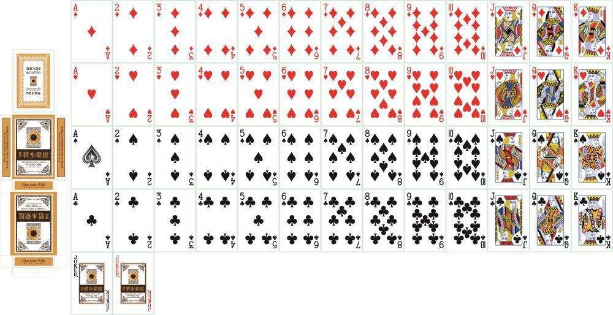

#### Theoretical Calculation

- Total Case

$$
All = \binom {52}{5}
$$

- Case of TWO PAIR
  $$
  tp = \binom {13}{3}\binom {3}{1}\binom {4}{2}\binom {4}{2} \binom{4}{1}\\
  P(tp) = \frac{tp}{All} = 0.0475
  $$

- Case of THREE OF A KIND

$$
tk = \binom {13}{3}\binom {3}{1}\binom {4}{3}\binom {4}{1} \binom{4}{1}\\
P(tk) = \frac{tk}{All} = 0.0211
$$

- Case of  FULLHOUSE

$$
fh = \binom {13}{2}\binom {2}{1}\binom {4}{3}\binom {4}{2}\\
P(fh) = \frac{fh}{All} = 0.00144
$$

- Case of FLUSH

$$
fl = 4 \times \binom{13}{5}\\
P(fl) = \frac{fl}{All} = 0.00198
$$

